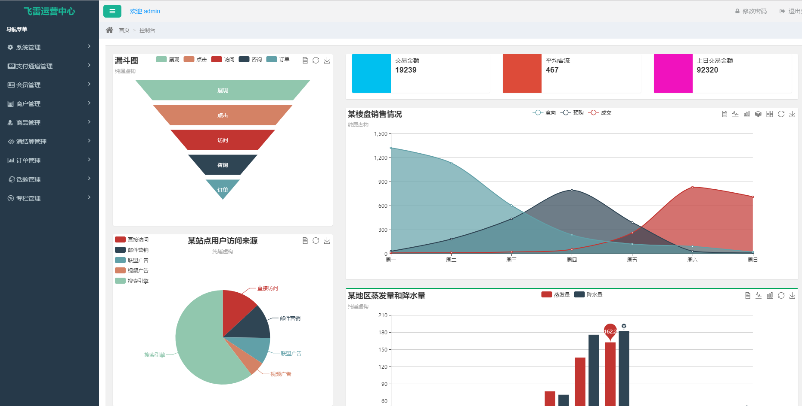

## flyray项目介绍

　　使用Spring+SpringMVC+Mybatis+dubbox 开发的一套分布式基础框架，提供支付、对账、清结算、客户管理、营销活动、库存管理、搜索模块、rocketmq做统一的消息队列中心

[项目主页](http://www.flyray.me)

[cms前端工程](https://git.oschina.net/boleixiongdi/flyray-cms-ui)

有兴趣、想学习部署的可以加群交流


### 使用技术

* 后台
	* `Maven`构建项目
	* `Jenkins`作为持续集成
	* 安全框架：`Apache Shiro 1.3`
	* 构上采用`Dubbox`作为RPC框架
	* 使用`Spring`+`Spring MVC`+`MyBatis`SSM框架
	* 数据库连接池使用`druid`
	* 数据库使用`MySQL`和`Redis`
	* 采用`elasticsearch`实现搜索服务
	* 采用`quartz`做任务调度
	* 注册中心`ZooKeeper`
	* 消息中间件`RocketMQ`,
	* 在分布式事务上则采用了[TCC](https://github.com/changmingxie/tcc-transaction)解决订单支付方面时效性要求性高的分布式事务,可靠的消息服务则来解决如会计记录等时效性要求低的分布式事务.
* 前台
	* 页面交互`Vue2.x`
	* 数据可视化`echarts `

### 项目进度


### 组织结构


### 接口总线系统
对外暴露统一规范的接口，包括各个子系统的交互接口示例图：

### 运营中心

### 商户中心

### 开放平台


##运行流程

##flyray-base 项目搭建

系统环境：windows10 jdk8 eclipse tomcat8

##搭建步骤

* 安装jdk1.8
* 安装maven
* 安装zookeeper
* 下载项目：git clone https://git.oschina.net/boleixiongdi/flyray.git
* eclipse导入maven项目
* 在群里下载缺少的dubbox包和zkclient包
* 解决缺少其他jar包问题，直到项目不报错


##导入后项目结构


##项目架构图


##项目启动步骤
* 导入数据库脚本 flyray-os-各模块总的数据库.sql flyray-security-三个中心的数据库.sql
* 修改config工程中的resource下的dubbo、数据库配置文件
* 修改  flyray-rbac 下的flyray-merchant-web、flyray-open-web、flyray-operation-web中的resource\service-consumer.xml文件的dubbo IP
* 启动注册中心即zookeeper
* 启动所有的服务提供者cms、crm、pay、erp
* 启动rest，rest既是cms、crm、pay、erp的服务消费者又是merchant-web、open-web、operation-web的服务提供者
* 最后启动merchant-web可以登录商户中心、启动operation-web可以登录运营中心、启动open-web可以看到开放平台

##感激
感谢

##关于作者

```javascript
  var ihubo = {
    nickName  : "flyray",
    site : "http://www.flyray.me"
  }
```