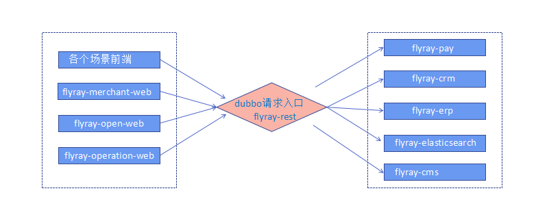

## flyray项目介绍

　　使用Spring+SpringMVC+Mybatis+dubbox 开发的一套分布式基础框架，提供支付、对账、清结算、客户管理、营销活动、库存管理、搜索模块、rocketmq做统一的消息队列中心

### 使用技术

* 后台
	* `Maven`构建项目
	* `Jenkins`作为持续集成
	* 安全框架：`Apache Shiro 1.3`
	* 构上采用`Dubbox`作为RPC框架
	* 使用`Spring`+`Spring MVC`+`MyBatis`SSM框架
	* 数据库连接池使用`druid`
	* 数据库使用`MySQL`和`Redis`
	* 采用`elasticsearch`实现搜索服务
	* 采用`quartz`做任务调度
	* 注册中心`ZooKeeper`
	* 消息中间件`RocketMQ`,
	* 在分布式事务上则采用了[TCC](https://github.com/changmingxie/tcc-transaction)解决订单支付方面时效性要求性高的分布式事务,可靠的消息服务则来解决如会计记录等时效性要求低的分布式事务.
* 前台
	* 页面交互`Vue2.x`
	* 数据可视化`echarts `

### 组织结构

### 接口总线系统
对外暴露统一规范的接口，包括各个子系统的交互接口示例图：

### 商户中心
