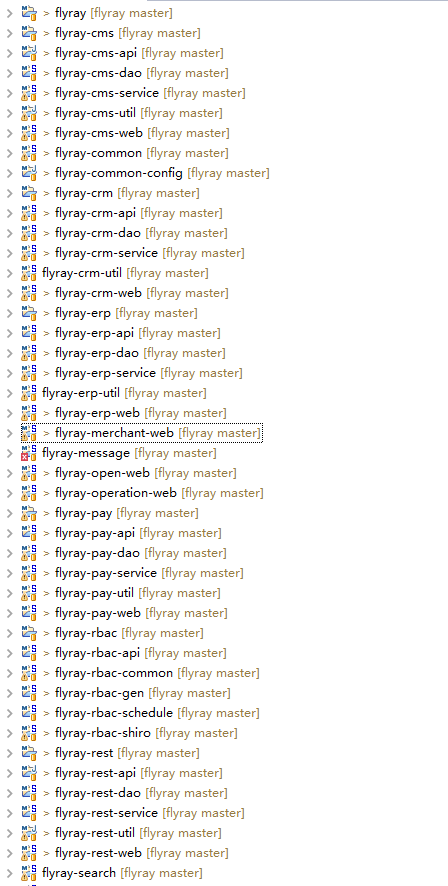

#flyray-base部署文档

[TOC]
## 一、前置条件
### 1.1系统要求
		jdk版本：要求java8
        内存：最小内存为4G，建议内存在8G以上
        磁盘：200G

## 二、安装步骤
### 2.1安装jdk-1.80
	    在本机安装jdk并配置成环境变量
### 2.2安装zookeeper
		安装3.4版本或以上zookeeper
### 2.3安装Tomcat-8
		安装tomcat8
### 2.4安装maven-3.3.9
		wget -c http://apache.fayea.com/maven/maven-3/3.3.9/binaries/apache-maven-3.3.9-bin.tar.gz
        tar -zxvf apache-maven-3.3.9
        在/etc/profile中添加以下几行配置信息：
        export MAVEN_HOME=/opt/json/jenkins-maven/apache-maven-3.3.9
		export PATH=${PATH}:${MAVEN_HOME}/bin
        执行source /etc/profile使环境变量生效
        用mvn -v检查maven是否安装成功
### 2.4安装node6.4设置成全局变量
		http://www.cnblogs.com/yzadd/p/6547668.html
### 2.5安装开发工具eclipse
		安装开发工具eclipse
### 2.5安装git工具
		安装git工具

## 三、配置步骤
### 3.1下载项目
####命令如下
		git clone https://gitee.com/boleixiongdi/flyray.git
### 3.2eclipse中导入maven工程，等maven自动下载依赖jar包
### 3.3导入成功后项目结构
   
### 3.4启动zookeeper注册中心
### 3.5修改数据库、zookeeper、dubbo、nginx等相关配置文件

### 3.5启动工程服务提供者crm、cms、erp、pay如图
   

## 四、参考资料

